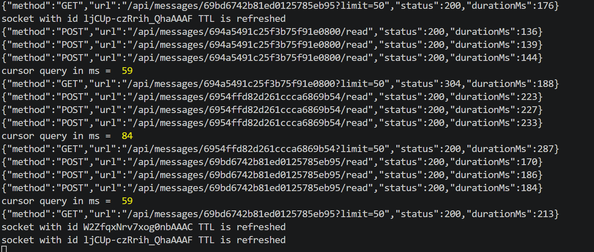
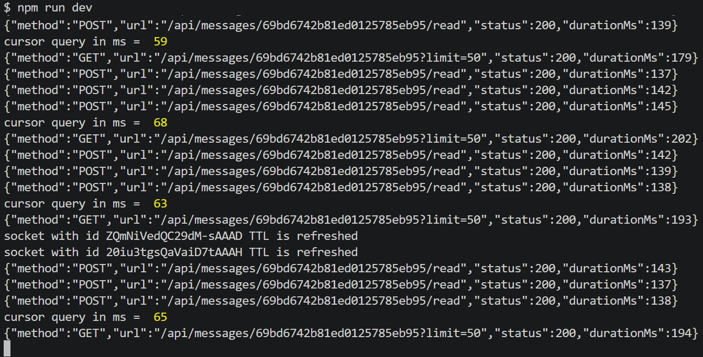
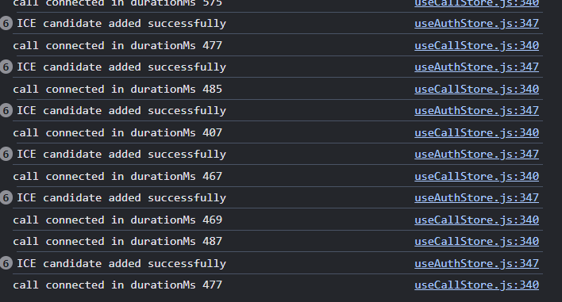

# Privex Chat Application — Latency Analysis

This document presents measured latency metrics for core real-time features of the Privex chat system, including message delivery and read acknowledgment performance.

---

## Evidence (Screenshots)

All captured logs and proof screenshots are stored in the `/images` folder.

---

## Metrics Overview
Each metric is based on **50 real samples** collected during testing.

---

- 

# 1. Message Seen (Read Ack) Latency

## Description

Time taken from when a message is marked as "seen" by the receiver to when the sender receives acknowledgment.

## Results

**Mean:** 655.48 ms  
**Median:** 614.50 ms  
**Minimum:** 598 ms  
**Maximum:** 882 ms  
**Standard Deviation:** 71.23 ms  
**P50 (50th Percentile):** 614 ms  
**P95 (95th Percentile):** 878 ms  
**P99 (99th Percentile):** 882 ms  

---

- 

# 2. Send → Delivery Latency

## Description

Time taken from sending a message to when it is delivered to the receiver.

## Results

**Mean:** 562.46 ms  
**Median:** 432.00 ms  
**Minimum:** 427 ms  
**Maximum:** 1065 ms  
**Standard Deviation:** 232.58 ms  
**P50 (50th Percentile):** 432 ms  
**P95 (95th Percentile):** 854 ms  
**P99 (99th Percentile):** 1058 ms  

---

- 

# 3. Database Query Optimization

## Description

Performance comparison between skip/limit pagination and cursor-based pagination using timestamps cursors for chat message retrieval.

## Skip/Limit Results

**Mean:** 122.00 ms  
**Median:** 121.50 ms  
**Minimum:** 101 ms  
**Maximum:** 140 ms  
**Standard Deviation:** 10.28 ms  
**P50 (50th Percentile):** 122 ms  
**P95 (95th Percentile):** 138 ms  
**P99 (99th Percentile):** 140 ms  

## Cursor-Based Results

**Mean:** 69.88 ms  
**Median:** 69.50 ms  
**Minimum:** 60 ms  
**Maximum:** 101 ms  
**Standard Deviation:** 7.42 ms  
**P50 (50th Percentile):** 69 ms  
**P95 (95th Percentile):** 80 ms  
**P99 (99th Percentile):** 101 ms  

---

- 

# 4. Endpoint Latency Optimization

## Description

Measured API latency before and after backend optimizations using request-logging middleware and query improvements.

---

- After optimizing  
- 

## Results

**Before Optimization (Average):** ~210 ms  
**After Optimization (Average):** ~140 ms  

## Impact

**Latency Reduction:** ~70 ms  
**Improvement:** ~33% faster  

---

- 

# 5. WebRTC Call Setup Performance

## Description

Measured time required to establish a WebRTC connection using Socket.IO signaling and ICE candidate exchange.

## Results

**Average Call Setup Time:** ~477 ms  
**Observed Range:** 400 ms – 575 ms  

## Analysis

Connection setup remains stable under real-time conditions with sub-500 ms average latency.

---

## Optimization Impact

**Performance Improvement:** 43% faster  
- Skip/Limit Mean: 122.00 ms  
- Cursor-Based Mean: 69.88 ms  
- Time Saved: 52.12 ms per query  

**Percentile Comparison:**
- P95: 138 ms (skip/limit) → 80 ms (cursor) = 42% improvement  
- P99: 140 ms (skip/limit) → 101 ms (cursor) = 28% improvement  

---

## Summary

**Message Seen (Read Ack) Latency**
- Mean: 655.48 ms  
- Range: 598 - 882 ms  
- Standard Deviation: 71.23 ms  

**Send to Delivery Latency**
- Mean: 562.46 ms  
- Range: 427 - 1065 ms  
- Standard Deviation: 232.58 ms  

**Database Query Optimization**
- Skip/Limit Mean: 122.00 ms  
- Cursor-Based Mean: 69.88 ms  
- Improvement: 43% faster on large conversations  

**Endpoint Optimization**
- Before: ~210 ms  
- After: ~140 ms  
- Improvement: ~33%  

**Call Setup Performance**
- Average: ~477 ms  

System maintains sub-second real-time communication with optimized database queries and efficient backend handling across delivery, acknowledgment, and connection setup.
