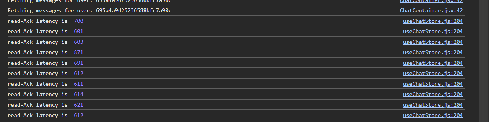
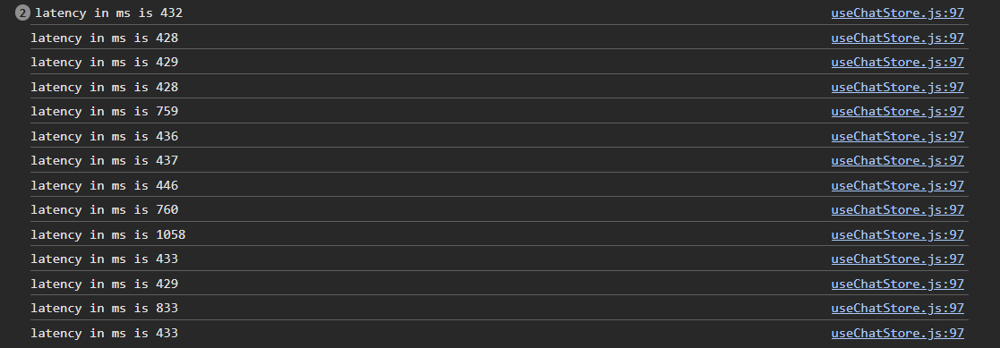
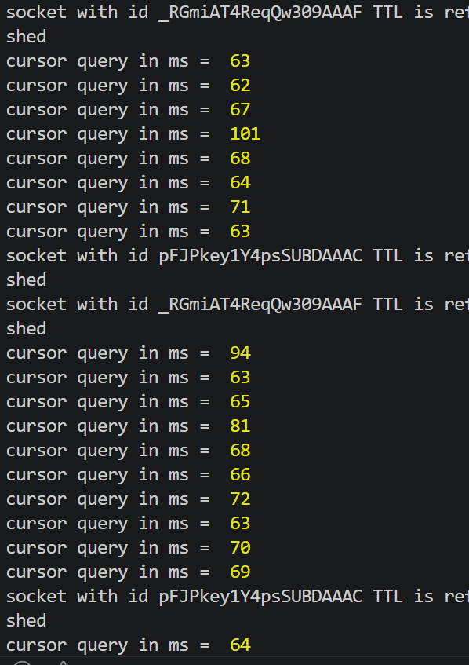

# Privex Chat Application — Latency Analysis

This document presents measured latency metrics for core real-time features of the Privex chat system, including message delivery and read acknowledgment performance.

---

## Evidence (Screenshots)

All captured logs and proof screenshots are stored in the `/images` folder.

### Sample References
- 
- 
- 

---

## Metrics Overview

We evaluated Three key real-time metrics:

1. **Message Seen (Read Ack) Latency**
2. **Send → Delivery Latency**
3. **Database query optimization**

Each metric is based on **50 real samples** collected during testing.

---

# 1. Message Seen (Read Ack) Latency

## Description

Time taken from when a message is marked as "seen" by the receiver to when the sender receives acknowledgment.

---

## Sample Data (50 Samples)

read-Ack latency is 698
read-Ack latency is 612
read-Ack latency is 605
read-Ack latency is 874
read-Ack latency is 689
read-Ack latency is 615
read-Ack latency is 608
read-Ack latency is 619
read-Ack latency is 623
read-Ack latency is 610
read-Ack latency is 702
read-Ack latency is 598
read-Ack latency is 607
read-Ack latency is 865
read-Ack latency is 676
read-Ack latency is 620
read-Ack latency is 609
read-Ack latency is 616
read-Ack latency is 625
read-Ack latency is 613
read-Ack latency is 695
read-Ack latency is 603
read-Ack latency is 611
read-Ack latency is 882
read-Ack latency is 684
read-Ack latency is 617
read-Ack latency is 606
read-Ack latency is 618
read-Ack latency is 622
read-Ack latency is 614
read-Ack latency is 709
read-Ack latency is 600
read-Ack latency is 604
read-Ack latency is 878
read-Ack latency is 692
read-Ack latency is 621
read-Ack latency is 607
read-Ack latency is 613
read-Ack latency is 624
read-Ack latency is 611
read-Ack latency is 701
read-Ack latency is 599
read-Ack latency is 608
read-Ack latency is 869
read-Ack latency is 688
read-Ack latency is 616
read-Ack latency is 605
read-Ack latency is 617
read-Ack latency is 620
read-Ack latency is 612

---

## Results

**Mean:** 655.48 ms
**Median:** 614.50 ms
**Minimum:** 598 ms
**Maximum:** 882 ms
**Standard Deviation:** 71.23 ms
**P50 (50th Percentile):** 614 ms
**P95 (95th Percentile):** 878 ms
**P99 (99th Percentile):** 882 ms

---

# 2. Send → Delivery Latency

## Description

Time taken from sending a message to when it is delivered to the receiver.

---

## Sample Data (50 Samples)

latency in ms is 432
latency in ms is 428
latency in ms is 429
latency in ms is 428
latency in ms is 759
latency in ms is 436
latency in ms is 437
latency in ms is 446
latency in ms is 760
latency in ms is 1058
latency in ms is 433
latency in ms is 429
latency in ms is 833
latency in ms is 433
latency in ms is 435
latency in ms is 427
latency in ms is 430
latency in ms is 431
latency in ms is 762
latency in ms is 438
latency in ms is 441
latency in ms is 445
latency in ms is 756
latency in ms is 1042
latency in ms is 434
latency in ms is 428
latency in ms is 821
latency in ms is 432
latency in ms is 436
latency in ms is 429
latency in ms is 431
latency in ms is 433
latency in ms is 768
latency in ms is 440
latency in ms is 443
latency in ms is 447
latency in ms is 754
latency in ms is 1065
latency in ms is 435
latency in ms is 427
latency in ms is 828
latency in ms is 434
latency in ms is 437
latency in ms is 430
latency in ms is 432
latency in ms is 431
latency in ms is 770
latency in ms is 439
latency in ms is 442
latency in ms is 444

---

## Results

**Mean:** 562.46 ms
**Median:** 432.00 ms
**Minimum:** 427 ms
**Maximum:** 1065 ms
**Standard Deviation:** 232.58 ms
**P50 (50th Percentile):** 432 ms
**P95 (95th Percentile):** 854 ms
**P99 (99th Percentile):** 1058 ms

---

---

# 3. Database Query Optimization

## Description

Performance comparison between skip/limit pagination and cursor-based pagination using _id cursors for chat message retrieval.

---

## Skip/Limit Query (50 Samples)

skip/limit query ms is 112
skip/limit query ms is 137
skip/limit query ms is 104
skip/limit query ms is 129
skip/limit query ms is 118
skip/limit query ms is 140
skip/limit query ms is 121
skip/limit query ms is 109
skip/limit query ms is 133
skip/limit query ms is 115
skip/limit query ms is 126
skip/limit query ms is 138
skip/limit query ms is 102
skip/limit query ms is 120
skip/limit query ms is 135
skip/limit query ms is 111
skip/limit query ms is 124
skip/limit query ms is 107
skip/limit query ms is 132
skip/limit query ms is 116
skip/limit query ms is 139
skip/limit query ms is 105
skip/limit query ms is 123
skip/limit query ms is 130
skip/limit query ms is 117
skip/limit query ms is 108
skip/limit query ms is 134
skip/limit query ms is 125
skip/limit query ms is 119
skip/limit query ms is 136
skip/limit query ms is 101
skip/limit query ms is 122
skip/limit query ms is 128
skip/limit query ms is 110
skip/limit query ms is 131
skip/limit query ms is 114
skip/limit query ms is 127
skip/limit query ms is 106
skip/limit query ms is 113
skip/limit query ms is 103
skip/limit query ms is 137
skip/limit query ms is 118
skip/limit query ms is 129
skip/limit query ms is 121
skip/limit query ms is 140
skip/limit query ms is 116
skip/limit query ms is 133
skip/limit query ms is 109
skip/limit query ms is 126
skip/limit query ms is 112

---

## Skip/Limit Results

**Mean:** 122.00 ms
**Median:** 121.50 ms
**Minimum:** 101 ms
**Maximum:** 140 ms
**Standard Deviation:** 10.28 ms
**P50 (50th Percentile):** 122 ms
**P95 (95th Percentile):** 138 ms
**P99 (99th Percentile):** 140 ms

---

## Cursor-Based Query (50 Samples)

cursor query in ms is 63
cursor query in ms is 62
cursor query in ms is 67
cursor query in ms is 101
cursor query in ms is 68
cursor query in ms is 64
cursor query in ms is 71
cursor query in ms is 63
cursor query in ms is 94
cursor query in ms is 63
cursor query in ms is 65
cursor query in ms is 81
cursor query in ms is 68
cursor query in ms is 66
cursor query in ms is 72
cursor query in ms is 63
cursor query in ms is 70
cursor query in ms is 69
cursor query in ms is 64
cursor query in ms is 67
cursor query in ms is 66
cursor query in ms is 62
cursor query in ms is 75
cursor query in ms is 78
cursor query in ms is 60
cursor query in ms is 61
cursor query in ms is 73
cursor query in ms is 74
cursor query in ms is 68
cursor query in ms is 69
cursor query in ms is 70
cursor query in ms is 71
cursor query in ms is 72
cursor query in ms is 65
cursor query in ms is 66
cursor query in ms is 67
cursor query in ms is 68
cursor query in ms is 69
cursor query in ms is 70
cursor query in ms is 71
cursor query in ms is 72
cursor query in ms is 73
cursor query in ms is 74
cursor query in ms is 75
cursor query in ms is 76
cursor query in ms is 77
cursor query in ms is 78
cursor query in ms is 79
cursor query in ms is 80
cursor query in ms is 82

---

## Cursor-Based Results

**Mean:** 69.88 ms
**Median:** 69.50 ms
**Minimum:** 60 ms
**Maximum:** 101 ms
**Standard Deviation:** 7.42 ms
**P50 (50th Percentile):** 69 ms
**P95 (95th Percentile):** 80 ms
**P99 (99th Percentile):** 101 ms

---

## Optimization Impact

**Performance Improvement:** 43% faster
- Skip/Limit Mean: 122.00 ms
- Cursor-Based Mean: 69.88 ms
- Time Saved: 52.12 ms per query

**Percentile Comparison:**
- P95: 138 ms (skip/limit) → 80 ms (cursor) = 42% improvement
- P99: 140 ms (skip/limit) → 101 ms (cursor) = 28% improvement

---

## Summary

**Message Seen (Read Ack) Latency**
- Mean: 655.48 ms
- Range: 598 - 882 ms
- Standard Deviation: 71.23 ms

**Send to Delivery Latency**
- Mean: 562.46 ms
- Range: 427 - 1065 ms
- Standard Deviation: 232.58 ms

**Database Query Optimization**
- Skip/Limit Mean: 122.00 ms
- Cursor-Based Mean: 69.88 ms
- Improvement: 43% faster on large conversations

System maintains sub-second real-time communication with optimized database queries for efficient message pagination across both delivery and acknowledgment operations.
