# Chat Message Flow Architecture

## Introduction

I built a real-time chat system with three interconnected parts that work together to handle message sending and receiving. This document explains how each part was designed and implemented.


## Overview

The message flow consists of three main components:

1. User selects a chat - initialization and state setup
2. User sends a message - optimistic UI with server confirmation
3. User receives a message - real-time socket delivery with filtering

Each part handles specific responsibilities to ensure messages are delivered reliably and the UI remains responsive.

---

## Part 1: User Selects a Chat

When a user clicks on a conversation, the system needs to prepare for real-time communication and load the chat state.

### What happens:

```
User clicks on "Alice" chat
    |
    v
setSelectedUser(userId) executes
    |
    +-- Store the selected user in state
    +-- Call API to mark all messages as read
    +-- Clear the unread badge
    +-- Subscribe to socket listeners
    |
    v
Ready to send and receive messages
```

### Implementation approach:

The function performs four sequential operations. First, it updates the global state to track which user is currently selected. Second, it communicates with the server to mark existing messages as read, ensuring server-side state matches client-side state. Third, it removes any unread badge for this user. Finally, it establishes socket listeners for real-time message delivery.

```javascript
async function setSelectedUser(userId) {
  // Update which user is currently selected
  store.setSelectedUser({ _id: userId })
  
  // Notify server that messages are now read
  await api.markMessagesRead({ chatId: userId })
  
  // Remove the unread notification
  store.ResetUnreadCount(userId)
  
  // Attach socket listeners for this chat
  subscribeToMessages(userId)
}
```

### Why this approach:

The separation of concerns allows each operation to be independent. If the API call to mark messages as read fails, the UI still updates immediately, providing fast feedback to the user. The socket subscription happens last so that by the time listeners are attached, the initial state is already established.

---

## Part 2: User Sends a Message

When sending a message, I needed the chat to feel responsive without waiting for server confirmation. This required using temporary message IDs and replacing them once the server responds.

### What happens:

```
User types "Hello" and clicks send
    |
    v
Create a temporary message
    |
    +-- Generate tempId using Date.now()
    +-- Push message to UI immediately
    |
    v
API call to backend
    |
    +-- Server saves the message
    +-- Server returns real message with real _id
    |
    v
Replace temporary with real message
    |
    +-- Find temp in messages array
    +-- Replace it with real message from server
    +-- Update status to "sent"
    |
    v
Handle ACK event (arrives independently)
    |
    +-- Server confirms delivery via socket
    +-- May arrive before or after API response
    |
    v
Message successfully sent and confirmed
```

### Implementation approach:

The process starts by creating a temporary message with a unique ID based on the current timestamp. This message is immediately added to the messages array so the user sees their message in the chat without waiting. While displaying this optimistic update, an API request is sent to the server.

When the server responds with the saved message (including the real database ID), the temporary message in the array is located and replaced with the real one. This ensures there is never a duplicate - one is swapped for the other.

Separately, the server emits an ACK (acknowledgment) event through the socket. This may arrive before or after the API response. The system tracks which messages have been acknowledged and handles both timing scenarios correctly.

```javascript
async function sendMessage(text) {
  // Step 1: Create temporary message with timestamp ID
  const tempId = Date.now().toString()
  const tempMessage = { 
    _id: tempId, 
    text, 
    status: "sending" 
  }
  
  // Step 2: Show immediately in UI (optimistic rendering)
  store.addMessage(tempMessage)
  
  // Step 3: Send to server
  const response = await api.sendMessage({ text })
  const realMessage = response.data
  
  // Step 4: Replace the temp with real (not push another)
  store.replaceMessage(tempId, realMessage)
  
  // Step 5: Handle eventual ACK confirmation
  // (receives separately via socket event)
}
```

### Why this approach:

Users perceive the chat as instant - their message appears immediately rather than after a network round trip (typically 200-500ms). The temporary ID is a valid placeholder until the server provides the real ID. By using replace instead of push, there is no risk of showing duplicate messages if both the temporary and real versions exist at the same time. The ACK event is handled independently because socket events and HTTP responses can arrive in either order.

---

## Part 3: User Receives a Message

Incoming messages arrive through a socket event. The system must filter these messages to ensure only relevant ones are processed and handle them correctly based on whether the chat is currently open.

### What happens:

```
Socket fires "newMessage" event
    |
    v
Run security and validation checks
    |
    +-- Verify socket connection exists
    +-- Verify message is for current user
    +-- Verify message is for current chat
    |
    v
Determine if chat is open or closed
    |
    +-- If OPEN: User is viewing this chat now
    +-- If CLOSED: User is not viewing this chat
    |
    v
Handle based on chat status
    |
    +-- If OPEN:
    |   +-- Add message to display
    |   +-- Mark as read on server
    |   +-- Do NOT increment unread badge
    |
    +-- If CLOSED:
    |   +-- Do NOT add to display
    |   +-- Increment unread badge
    |
    v
UI updates accordingly
```

### Implementation approach:

When a message arrives via socket, the first priority is validation. The socket connection is verified to exist. The message is checked to ensure it belongs to the current user (by examining the chatId). If these checks fail, the message is discarded.

Next, the system checks whether the chat containing this message is currently open. If the user is viewing that chat, the message is added to the display and marked as read on the server. No unread badge is shown because the user is actively viewing the conversation.

If the chat is not open, the message is not added to the messages array. Instead, the unread counter is incremented so the user sees a badge indicating new activity.

```javascript
socket.on("newMessage", (data) => {
  // Validation: Socket exists
  if (!socket) return
  
  // Validation: Message is for this user
  const [user1, user2] = data.chatId.split("_")
  if (![user1, user2].includes(currentUserId)) return
  
  // Check if chat is currently open
  if (store.selectedUser._id === data.senderId) {
    // Chat is open - add to messages
    store.addMessage(data)
    
    // Mark as read on server
    api.markRead({ chatId: data.chatId })
    
    // Do NOT increment unread
  } else {
    // Chat is closed - just increment badge
    store.IncrementUnreadCount(data.senderId)
  }
})
```

### Why this approach:

Guard checks prevent crashes when the socket is disconnected and prevent displaying messages from wrong chats (privacy and correctness). The two different behaviors for open vs closed chats create intuitive UX. If a user is actively viewing a conversation, they see new messages immediately and the server knows they have read it. If they are not viewing the chat, they get a badge alert instead.

---

## Critical Implementation Details

### Socket Listener Management

I discovered that socket listeners needed careful management. Without removing old listeners, they would accumulate each time a user switched chats.

```javascript
function subscribeToMessages() {
  // Remove any previously attached listeners first
  socket.off("newMessage")
  socket.off("message-sent-Ack")
  
  // Then attach fresh listeners
  socket.on("newMessage", handler)
  socket.on("message-sent-Ack", handler)
}

function unsubscribeToMessages() {
  // Clean up when leaving chat
  socket.off("newMessage")
  socket.off("message-sent-Ack")
}
```

Without this cleanup, after switching between 5 chats, there would be 5 listeners running for each event. A single incoming message would be processed 5 times, appearing as duplicates and causing memory leaks.

### Message Array Updates

When a message is sent, it is crucial to replace the temporary message rather than adding the real one alongside it.

Incorrect approach:
```javascript
store.messages.push(tempMessage)
// Later...
store.messages.push(realMessage)
// Result: User sees two identical messages
```

Correct approach:
```javascript
store.messages.push(tempMessage)
// Later...
const index = store.messages.findIndex(m => m._id === tempId)
store.messages[index] = realMessage
// Result: One message, updated with real data
```

### Unread Count Logic

The unread count must only be incremented for chats that are not currently open. If a user is viewing a chat and new messages arrive, those should be appended to the display and marked as read, not counted as unread.

### State Structure

The global state maintains four key pieces of data:

```javascript
{
  selectedUser: {
    _id: "user123",
    name: "Alice"
  },
  
  messages: [
    {
      _id: "msg_id_from_server",
      text: "Hello",
      senderId: "user456",
      status: "sent",
      createdAt: "2024-03-22T10:00:00Z"
    }
  ],
  
  unreadCounts: {
    "user456": 2,
    "user789": 1
  },
  
  ackedMessageIds: Set()
}
```

---

## Complete Message Lifecycle

From login to switching between chats:

```
User Login
    |
    v
Socket connects (no listeners attached yet)
    |
    v
User Selects Chat "Alice" (Part 1)
    |
    +-- Previous listeners unsubscribed
    +-- setSelectedUser("alice_id") called
    +-- New listeners subscribed
    |
    v
Real-time messaging active
    |
    +-- User sends message (Part 2)
    |   |-- tempId created and shown
    |   |-- API called
    |   |-- Message replaced with real
    |
    +-- Messages arrive from Alice (Part 3)
    |   |-- Guard checks pass
    |   |-- Chat is open, so append
    |   |-- Mark read on server
    |
    v
User Switches to Chat "Bob"
    |
    +-- Alice listeners unsubscribed
    +-- setSelectedUser("bob_id") called
    +-- Bob listeners subscribed
    |
    v
Cycle repeats
```

---
## Message Flow Architecture



For detailed explanation of how the message flow is implemented, see [Chat Architecture Documentation](./MessagesFlowImplementation/CHAT_ARCHITECTURE.md)

## Common Issues and Solutions

During implementation, I encountered several problems and had to refactor the approach.

**Issue 1: Messages appearing multiple times**
This occurred because socket listeners were accumulating. Each chat switch added a new listener without removing the old one. After switching between 5 chats, each message would process through 5 listeners and appear 5 times in the UI.

Solution: Always call socket.off() before socket.on() when subscribing to new listeners.

**Issue 2: Duplicate messages in the array**
When a message was sent, the temporary version was added to the array and when the real version arrived from the server, it was pushed as a new entry instead of replacing the temp.

Solution: Use array index replacement instead of push for the real message.

**Issue 3: Messages from other chats appearing**
Without guard checks, the socket handler would add any incoming message to the current chat, even if it was meant for a different conversation.

Solution: Validate the chatId before processing the message.

**Issue 4: Incorrect unread counts**
The unread count was being incremented for all incoming messages, including those in the currently open chat.

Solution: Check if the chat is open before incrementing. If open, append to display instead.

---

## Conclusion

The three-part architecture handles the full message flow from user interaction through server confirmation. Each part has specific responsibilities and guard checks ensure data integrity. The implementation prioritizes responsive UI through optimistic updates while maintaining eventual consistency with the server.
