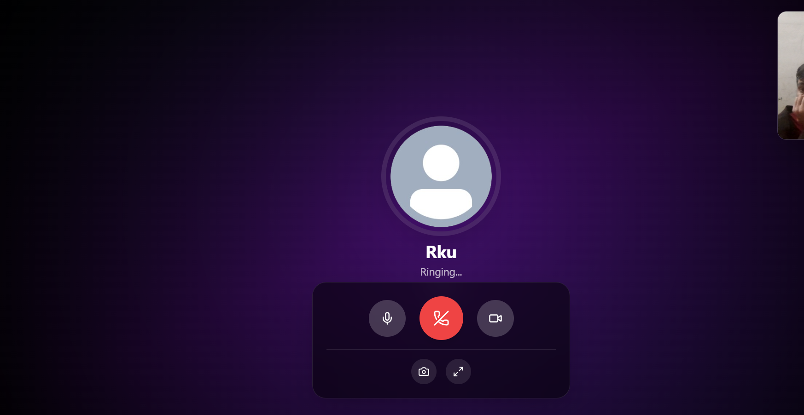
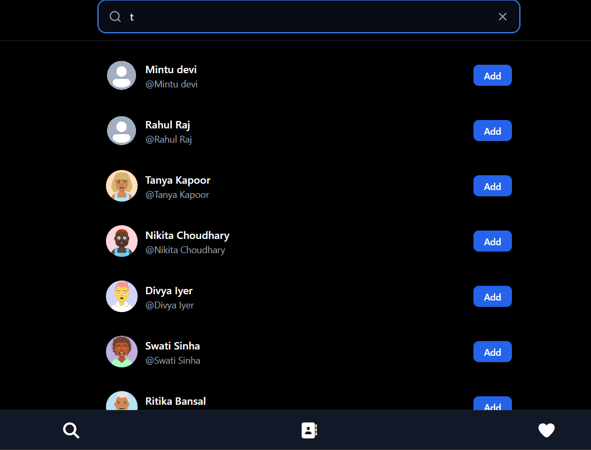
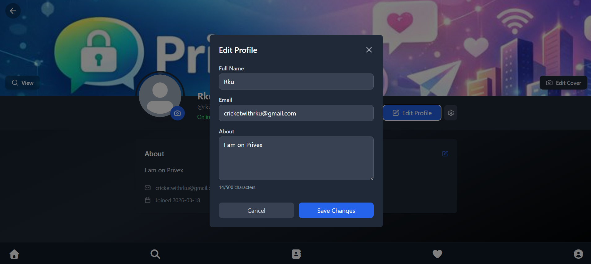

# Privex

## Real-Time Chat Application

A modern MERN chat application with real-time messaging, audio/video calling, and secure authentication. Built with Socket.IO for real-time communication and WebRTC for peer-to-peer calling.

**[Visit Live App](https://privex-1.onrender.com/login)**

---

## Features

**Core Messaging**
- Real-time private chat with Socket.IO
- Read receipts and message acknowledgment
- Cursor-based pagination for message history
- Online/offline status indicators
- User search and friend management

**Calling**
- Audio and video calling via WebRTC
- 1-to-1 peer-to-peer calls
- HD quality with low latency

**User Experience**
- Image sharing in conversations
- Typing indicators
- Customizable chat themes
- Responsive design for all devices
- Clean, modern UI

**Security**
- Secure authentication and authorization
- Password hashing
- CORS protection
- HTTPS encryption

---

## Tech Stack

| Layer | Technology |
|-------|-----------|
| Frontend | React + Vite, Tailwind CSS |
| Backend | Node.js, Express.js |
| Real-Time | Socket.IO |
| Calling | WebRTC |
| Database | MongoDB |
| Hosting | Render.com |

---

## Project Structure

```
privex/
├── frontend/
│   ├── chat_app/      # React + Vite application
│   └── ...
├── backend/           # Node.js + Express API
└── README.md
```

---

## System Architecture

The application is built on a three-layer architecture:

```
┌─────────────────────────────────────┐
│     CLIENT (React + WebRTC)         │
│  ┌───────────────────────────────┐  │
│  │ React UI - Modern Interface   │  │
│  ├───────────────────────────────┤  │
│  │ Socket.IO Client (Messaging)  │  │
│  ├───────────────────────────────┤  │
│  │ WebRTC (Audio/Video Calls)    │  │
│  └───────────────────────────────┘  │
└──────────────┬──────────────────────┘
               │
        ┌──────▼──────────┐
        │  Socket.IO      │
        │  Signaling      │
        │  Server         │
        └──────┬──────────┘
               │
        ┌──────▼──────────┐
        │  Backend        │
        │  Node.js +      │
        │  Express        │
        │  MongoDB        │
        └─────────────────┘
```

---

## Real-Time Messaging Flow

1. User sends a message through the React UI
2. Message is emitted to Socket.IO server
3. Server validates and stores in MongoDB
4. Server broadcasts to recipient via Socket.IO
5. Recipient receives and displays in real-time
6. Read receipt is sent back to sender

---

## WebRTC Calling Flow

1. User initiates a call
2. Signaling server relays call information via Socket.IO
3. Both clients establish WebRTC connection
4. Media streams (audio/video) flow directly between peers
5. Call ends and connection closes gracefully

---

## Application Interface

### Chat Interface


Real-time messaging with read receipts, message acknowledgments, image sharing, and typing indicators. Clean, intuitive design with smooth message pagination.

### Video Calling


HD video calling with minimal controls. Peer-to-peer connection ensures privacy and low latency. Easy to accept, reject, or end calls.

### User Search


Find friends instantly with real-time search. Browse users with pagination support and add them to your contact list.

### User Profile


Manage your profile, view user details, and maintain your friend list with online/offline status indicators.

---

## Getting Started

### Quick Start

1. Visit [https://privex-1.onrender.com/login](https://privex-1.onrender.com/login)
2. Create an account with email and password
3. Search for friends to connect
4. Start chatting or make a call

### Requirements

- Modern web browser (Chrome, Firefox, Safari, Edge)
- Webcam and microphone for calling
- Stable internet connection

---

## Development Roadmap

### Phase 1 - Complete
- [x] Real-time messaging
- [x] 1-to-1 audio/video calling
- [x] Friend management
- [x] User search
- [x] Modern UI
- [x] Message read receipts
- [x] Image sharing

### Phase 2 - In Progress
- [ ] Offline message queue
- [ ] Message retry mechanism
- [ ] Rate limiting
- [ ] Encryption at rest
- [ ] Input validation

### Phase 3 - Planned
- [ ] End-to-End Encryption (E2EE)
- [ ] Group calls (3+ users)
- [ ] Screen sharing
- [ ] Call recording
- [ ] Message reactions
- [ ] Dark mode UI
- [ ] GIF and file support

---

## Key Features Overview

| Feature | Status | Details |
|---------|--------|---------|
| Real-Time Messaging | Live | Socket.IO based |
| Video Calling | Live | WebRTC P2P |
| Audio Calling | Live | Crystal clear |
| Read Receipts | Live | Know when read |
| Image Sharing | Live | Send images |
| User Search | Live | Instant results |
| Friend Management | Live | Add/remove easily |
| Online Status | Live | Real-time indicators |
| Offline Queue | Coming | Pending messages |
| E2E Encryption | Coming | Military-grade |
| Group Calls | Coming | 3+ participants |
| Screen Sharing | Coming | Call support |
| Call Recording | Coming | Record calls |

---

## Security Features

**Current**
- Secure authentication with hashing
- Session management
- CORS protection
- HTTPS encryption in transit
- Password hashing with bcrypt

**Coming Soon**
- End-to-End Encryption (E2EE)
- Encryption at rest
- Rate limiting for API
- Advanced input validation
- Message encryption

---

## Performance

```
Core Messaging:        ██████████ 100%
Video Calling:         ██████████ 100%
User Search:           ██████████ 100%
Security:              ████░░░░░░ 40%
Documentation:         ██████░░░░ 60%
```

---

## Deployment Status

| Component | Status |
|-----------|--------|
| Frontend | Live |
| Backend API | Live |
| Database | Connected |
| WebRTC | Functional |
| Socket.IO | Enabled |

---

## Contributing

Privex is a portfolio project. Contributions are welcome!

1. Fork the repository
2. Create a feature branch
3. Make improvements
4. Submit a pull request

---

## License

MIT License - see LICENSE for details

---

## Support

Have questions or found a bug?

- Report Issues: [GitHub Issues](https://github.com/yourusername/privex/issues)
- Email: [your.email@example.com]
- Feature Requests: [GitHub Discussions](https://github.com/yourusername/privex/discussions)

---

## What's Coming

**End-to-End Encryption** - Messages encrypted only for you and recipient

**Group Calling** - Call 3+ people simultaneously with conference features

**Screen Sharing** - Share your screen during calls for collaboration

**Call Recording** - Record and save important conversations securely

**Dark Mode** - New UI theme for comfortable viewing

---

## Project Info

Status: Active Development | Version: 1.0.0 | Last Updated: March 2026

Made with care for modern real-time communication
